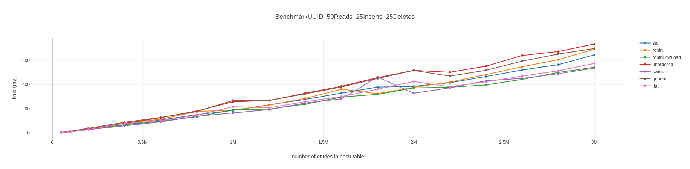

# Golang Hash Map Benchmark

[](https://github.com/EinfachAndy/bench-hashmaps/blob/main/LICENSE)

# How to run:

```bash
git clone git@github.com:EinfachAndy/bench-hashmaps.git
cd bench-hashmaps
make run-bench
make charts
```

## Run custom benchmark

The Makefile target `run-bench` executes a new benchmark run and stores the results in `results/<>.out`.
The Default settings can be changed with the following environment variables:

- `RANGES` list of integers (n)
- `MAPS` list of map names

```bash
MAPS="swiss std" RANGES="50000 100000 200000 400000" make run-bench
```

### Supported hash maps

| Name          | Module                |
|---------------|-----------------------|
| std           | golang map |
| robin         | https://pkg.go.dev/github.com/EinfachAndy/hashmaps#RobinHood (lf 0.8) |
| robinLowLoad  | https://pkg.go.dev/github.com/EinfachAndy/hashmaps#RobinHood (lf 0.5) |
| unordered     | https://pkg.go.dev/github.com/EinfachAndy/hashmaps#Unordered |
| flat          | https://pkg.go.dev/github.com/EinfachAndy/hashmaps#Flat |
| swiss         | https://pkg.go.dev/github.com/dolthub/swiss#Map |
| generic       | https://pkg.go.dev/github.com/zyedidia/generic/hashmap#Map |
| cornelk       | https://pkg.go.dev/github.com/cornelk/hashmap#Map |
| sync          | https://pkg.go.dev/sync#Map |

## Generate charts

The Makefile target `charts` generate HTML output for all benchmark files in the directory `results`.

```bash
make charts
firefox results/IntelRCoreTMi7-10610UCPU180GHz_2023-06-11_00-36-01.out.html
```

### Example Chart



# Contributing

If you would like to add a new benchmark or hash map, feel free to contribute.

### Note:
This benchmark is inspired from [Benchmark of major hash maps implementations](https://tessil.github.io/2016/08/29/benchmark-hopscotch-map.html).
